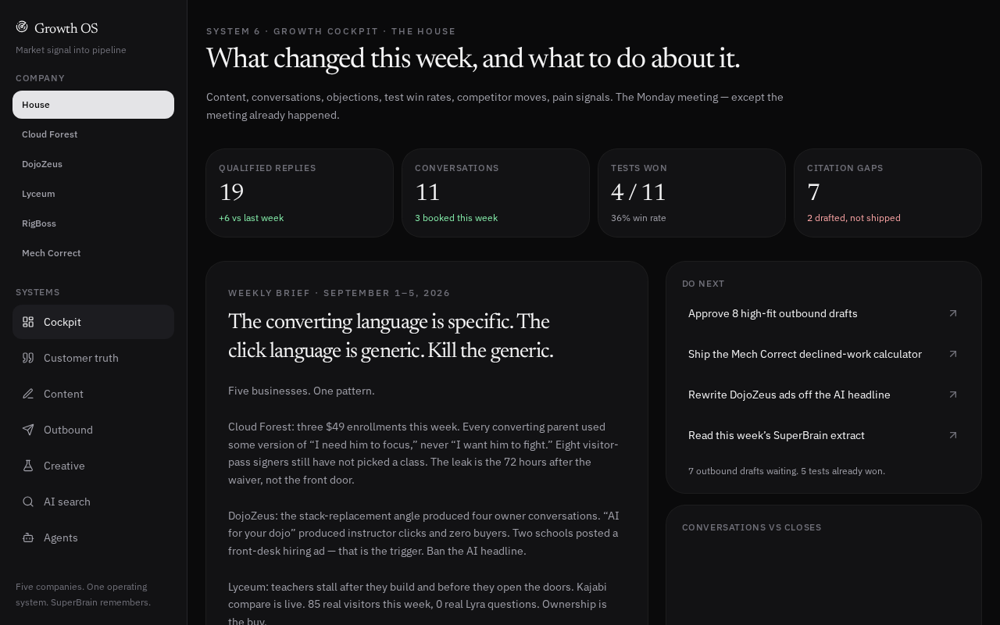
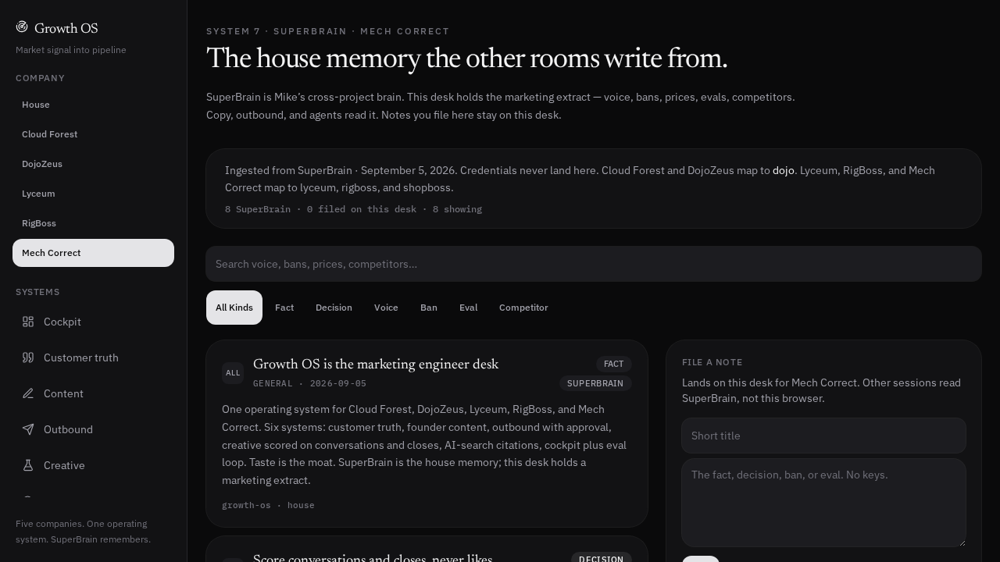

# Growth OS

Internal marketing engineer desk for five Cloud Forest companies. Built from Greg Isenberg’s “Marketing Engineer” job: customer truth, founder content, outbound with approval, creative tests scored on conversations/closes, AI-search citations, a weekly cockpit, and SuperBrain as house memory.

**Owner:** Michael Johnson / Cloud Forest

## Open this

| What | Link |
|---|---|
| **Git repo (this project)** | https://github.com/Mike-CloudForest/growth-os |
| **Live desk (searchable SuperBrain extract)** | https://mike-cloudforest.github.io/ |
| **AI briefing (Claude / ChatGPT / Gemini start here)** | https://raw.githubusercontent.com/Mike-CloudForest/growth-os/main/docs/llms.txt |
| **Machine extract (30 notes)** | https://raw.githubusercontent.com/Mike-CloudForest/growth-os/main/docs/brain.json |
| SuperBrain search | `Growth OS marketing desk` |



Cockpit for all five companies: weekly brief, KPIs, eval loop (double / kill / watch), and the rooms on the left.



SuperBrain screen: house memory the copy, outbound, and agents read before they write.

## Companies

| Desk | Site | SuperBrain project |
|---|---|---|
| Cloud Forest | [traincloudforest.com](https://traincloudforest.com) | `dojo` |
| DojoZeus | [dojozeus.com](https://dojozeus.com) | `lyceum` (peer brand of Lyceum; school ops also `dojo`) |
| Lyceum | [joinlyceum.com](https://joinlyceum.com) | `lyceum` |
| RigBoss | [rigboss.app](https://rigboss.app) | `rigboss` |
| Mech Correct | [mechcorrect.com](https://mechcorrect.com) | `shopboss` |

## What the rooms do

1. **Cockpit** — weekly brief, KPIs, eval loop (double / kill / watch).
2. **Customer truth** — objections with receipts.
3. **Content** — founder posts from winning hooks and voice.
4. **Outbound** — drafts queue; a human approves anything that leaves the building.
5. **Creative** — tests scored on conversations and closes, not likes.
6. **AI search** — citation pages a buyer would get from ChatGPT.
7. **Agents** — jobs with memory. They draft. They do not send.
8. **SuperBrain** — marketing extract of the house knowledge base.

## Hard rules (do not violate)

- Score tests on **conversations and closes**. Clicks without a buyer are a kill.
- Agents draft. A human approves outbound.
- **DojoZeus:** founding **$59.99/mo × first 35**, then **$149**. Not $99 / 20 / $169. Never headline “AI for your dojo.” Peer brand of Lyceum — zero Lyceum traces on dojozeus.com public surfaces. Combat Factory (`thecombatfactory.com`) is the concierge/beta school.
- **Lyceum:** Starter $49+5%, Pro $99+2%, Academy $249+0%. Never call Starter capped, limited, or a dead end. Never sneer at Kajabi. Every traffic count is **Real vs Ours**. Week to 2026-09-05: 85 real visitors, 0 real Lyra questions. Kajabi compare (`/vs/kajabi`) is live.
- **RigBoss:** public catalog is **rigboss.app** / **rigboss.io** — “the operating system for every tractor.” App is **app.rigboss.app**. Never say we replace the ELD.
- **Mech Correct:** wedge is Tekmetric-class UX + FullBay leak-hunting + AI advisor. Demo on a photo of a leak. CarSignal launched Aug 17 2026 at $200/mo.
- **Cloud Forest:** Greensboro Martial Arts Academy LLC dba Cloud Forest Martial Institute, 719 W Gate City Blvd, Greensboro, NC. Parents buy a known name, not combat.
- No Stripe keys, passwords, account IDs, or credential locations in this repo or in SuperBrain notes.

## Memory contract

SuperBrain MCP cannot be called from the deployed browser.

- **Into the OS:** marketing facts live in `src/lib/brain.ts`. Last ingest 2026-09-05.
- **Out of the OS:** Grok writes desks back to SuperBrain with `brain_add`, tagged by project. Search “Growth OS marketing desk”.
- **Filed notes** on the SuperBrain screen stay in that browser. To make one durable across Claude/ChatGPT/Gemini, add it to SuperBrain.

## Stack

TanStack Start + React 19 + Tailwind v4 + zustand persist. Auth off. No database. Copy generation uses xAI `grok-4.5` via `XAI_API_KEY` (server-only, user-initiated).

```bash
npm install
npm run dev
npm run build
npm run typecheck
```
